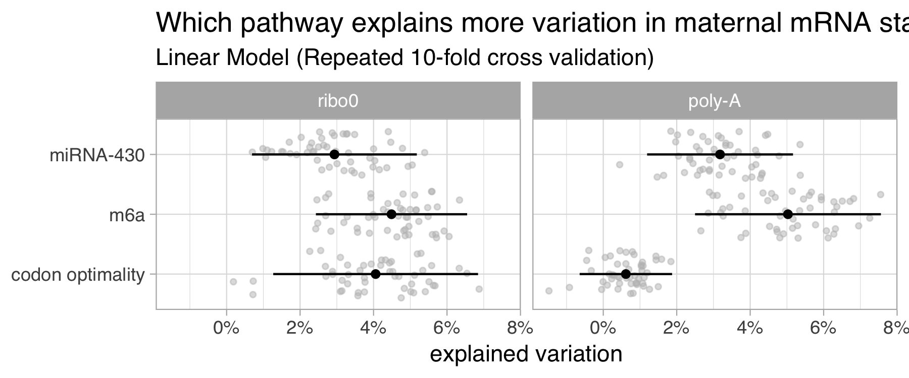

# Which pathway explains more variation of maternal mRNA degradation rates in WT conditions?

Approach:

Use a linear model $decay ~ pathway$ with repeated cross validation and 
evaluate the data with the $R^2$ score

+ Interestingly codon optimality does not contribute to mRNA stability in
poly-a data.
+ Overall m6a is the strongest predictor.

